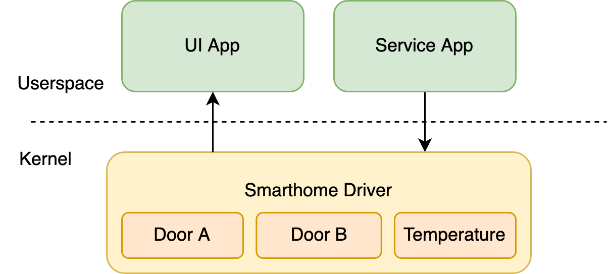

# Tock Tutorial Rust Nation UK

The purpose of this turtorial is to build a simple smarthome device.

To work, the smarthome device has the folllowing components:
1. a smarthome kernel driver that will act as the data model
2. a smarthome service that will pull the data from the sensors (doors,
  temperature) and send the it to the driver for storing
3. a ui app that displays the doors status and the temperature



For this tutorial you will have to implements the driver (1) and
the service (2). The UI app (3) is already implemented using
the C/C++ language.

## Folders
This template has the kernel and upser space applications in the
same repository. The organization is the following:
- `kernel` - everything related to the kernel
  - `tock` - the Tock kernel repository
  - `smarthome` - the entry point (`main.rs`) for the smarthome kernel
  - `drivers` - drivers that we want to include in the kernel
- `applications` - everything that is required for applications
  - `c` - C applications
    - `libtock-c` - the C library for Tock applications
    - `example_app` - an example app
    - `drivers` - libraries for the drivers that we added to the kernel
    - `ui` - the UI application that displays the doors status and the temperature
  - `rust` - Rust applications
    - `libtock-rs` the Rust library for Tock applications
    - `example_app` - an example app
    - `service` - the service app that we implement
- `build` - the build folder where the UF2 files are placed

## Driver
Write a Tock driver that acts like a model for the smarthome. It stores:

| Value | Description | Data Type |
|-------|-------------|-----------|
| `door_a` | The status of the door connected to buttton A | `bool` |
| `door_b` | The status of the door connected to buttton B | `bool` |
| `temperature` | The temperature in hundreds of centigrades | `i32` |

The driver exposes the following API:

| Cmd | Description | Data 1 | Data 2 | Return |
|-----|-------------|--------|--------|--------|
| 0 | Driver exists | N/A | N/A | `success` |
| 101 | Stores the status of the doors | Door A | Door B | `success` |
| 102 | Stores the temperature | temperature in hunderds of centigrades | N/A | `success` |
| 201 | Returns the status of the doors | N/A | N/A | `success_u32_u32` |
| 202 | Returns the temperature | N/A | N/A | `success_u32` |


### Write the driver

The first step in writing the driver is to define a data structure `Smarthome` that 
stores the data.

The second step is to implement the `SyscallDriver` trait for `Smarthome`.

> Hint: As the `SyscallDriver` trait uses `&self` for its methods, you have to use interior mutability to store the data.

### Register the driver

To use the driver, it has to be registered with the *board*, meaning it has to be instatiated in `main.rs`.
Follow the staps to to this:

1. Define the driver in the `PicoExplorerBase` structure.
2. Connect the `smarthome::DRIVER_NUM` to the kernel by adding it in the `with_driver` function
3. Instantiate the driver in the `main` function

> Hint: use `static_init!` get a reference to the driver

### Build the kernel
To build the kernel run `make` in the `smarthome` folder.

### Flash the kernel
To flash the kernel to the board, run the `make kernel`. This will create a UF2 file in `build/kernel.uf2`. Copy this file to the Pi's USB driver.

To connect the PI's USB drive, disconnect the micri usb cable from the Pi, press and hold the BOOTSEL button and connect 
the micro usb cable. Release the BOOTSEL button.
A USB driver should become available.

### Process Console

Tock offers a simple command line to manage processes. To access it, run a
serial terminal and connect to the virtual USB port using a 115200 baudrate.

To easiest way to connect to the board is to use [tockloader](https://github.com/tock/tockloader). To install
tockloader run `pip3 install tockloader`.

> Note You might have to use `sudo` to install

If tockloader is not working, use:

| OS | Software |
|----|----------|
| Windows | [putty.exe](https://www.chiark.greenend.org.uk/~sgtatham/putty/latest.html) |
| Linux   | screen    |
| macOS   | screen    |

### Software reset

To avoid puggin in and out the USB cable, you can reset the board using the process console. 

Press and hold the BOOTSEL button and run the `reset` command in process console. Release the BOOTSEL button.

```
tock$ reset
```


## Service (Rust)
Write a rust application that implements the logic of the smart home.

### Build
To build the app, run `make raspberry_pi_pico` in the app folder.

### Driver API

The first step is to implement the driver API that talks to the smarthome driver.

Use the `exists` function example tom implement the setting of the doors status and the temperature.

### Service

Implement the services as an infinte loop that does the following:

1. reads the door statuses
2. sends the statuses to the driver
3. reads the temperature
4. sends the it to the driver
5. waits for a few milliseconds

## Flashing the apps
The smarthome will run two apps:
- the UI app
- the service app

To load both of the app, the `make app` command does the following:
- builds the kernel as an ELF file
- builds the UI app as a TBF file
- builds the service app as a TBF file
- merges the two TBF files (UI and service, in this order)
- writes the merged TBFs as the `.apps` section of the kernel ELF file
- converts the ELF file to a UF2

### Relocation
While the UI app is relocatable, meaning that it can be loaded at any address, 
the service app is not. It uses a fixed loading address 
where it loads. That address depends on the size of
the UI app. To figure out the address that the Rust app
has to ooad to, follow:
- enable the *debug_load_processes* feature for the `kernel` crate
- load the UF2 file with the apps
- the kernel will print the required address
  - first it prints the Flash address, modify it and reflash the app
  - then it prints the RAM address

Modify the `layouts/raspberry_pi_pico.ld` file and set the required addresses for the FLASH and RAM.

## Extra

Implement the following extra features:
1. Turn ON the Pi's LED if one of the doors is open
2. Use button X to set and un set the smarthouse's alarm. The alarm will sound (blink the LED) when it is ON
if one of the doors is open more than 10 seconds.
